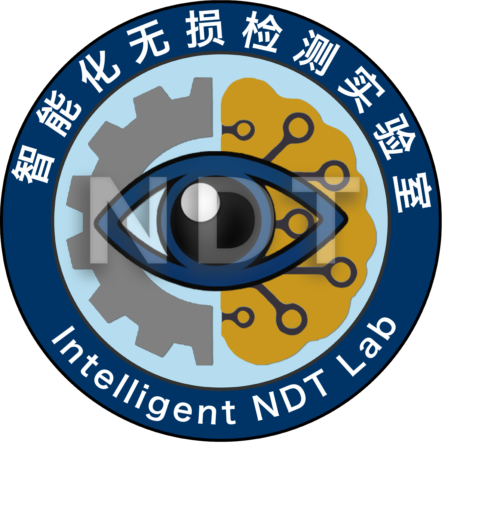
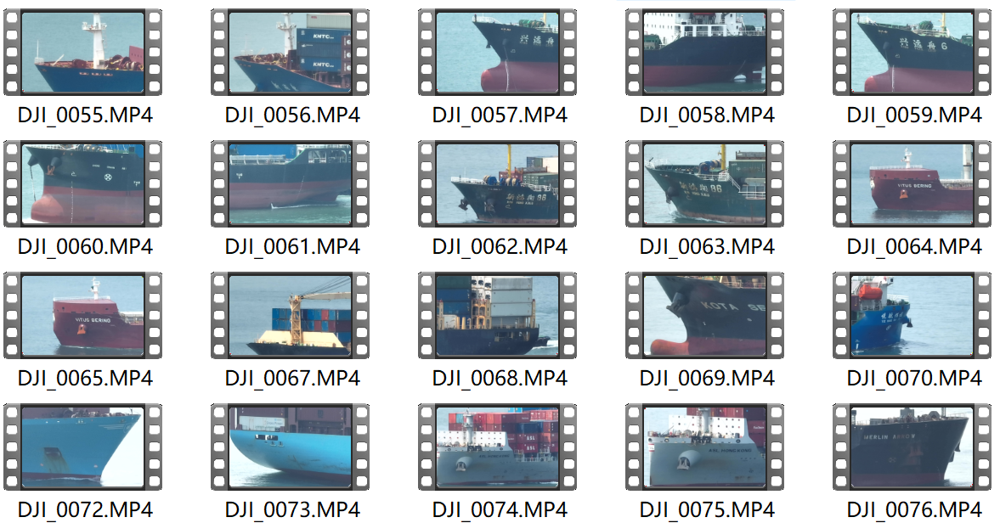
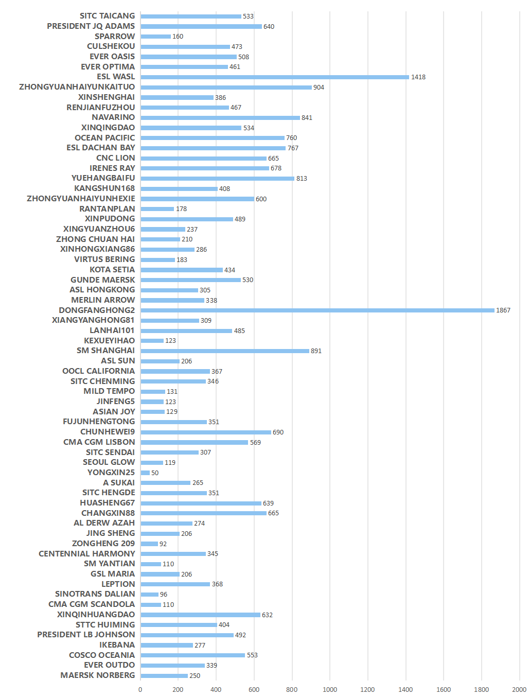
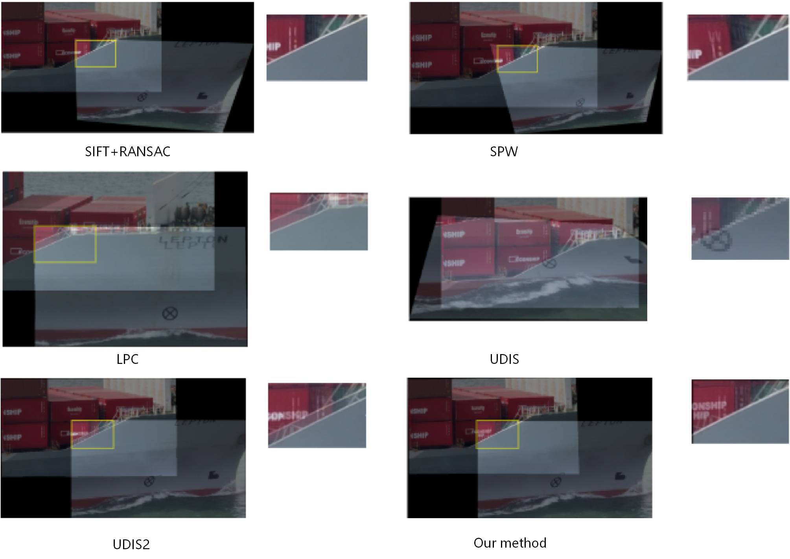
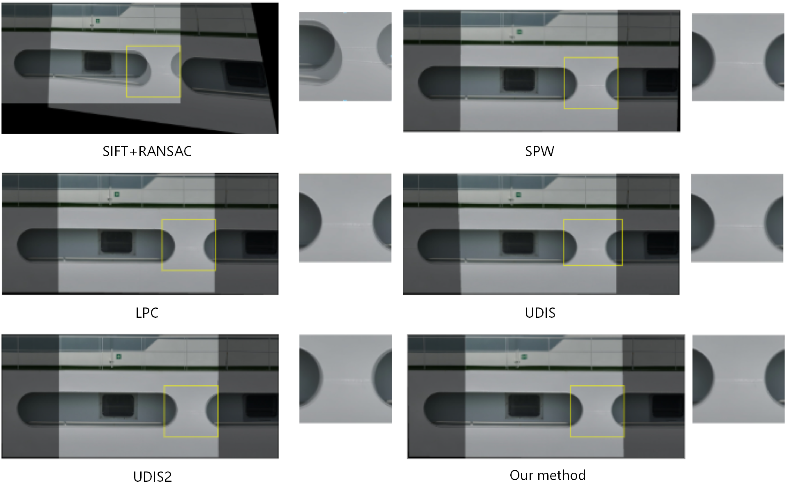
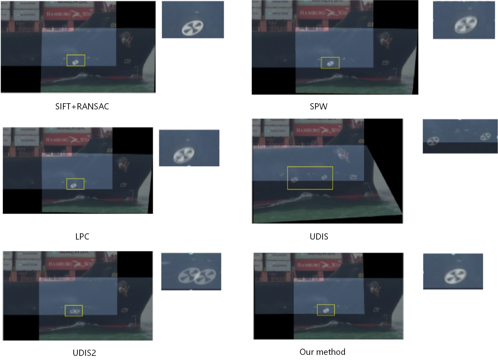

# ShipHull66 Dataset(OE 2026) 


##### *INDTLab.*

To address the lack of dedicated benchmarks for maritime inspection, we introduce ShipHull66, the first large-scale dataset specifically curated for UAV-acquired hull image stitching. The construction of this benchmark addresses three domain-specific challenges:

- Restricted Access, which strictly limits spatial and temporal windows for data collection in port zones;
- Dynamic Instability, where vessel motion and attitude variations necessitate adaptive acquisition methodologies;
- Operational Complexity, requiring precise UAV manoeuvring to ensure data usability for dense matching. 

We developed a systematic acquisition pipeline using the DJI Mavic 3 Pro platform to ensure diverse, high-fidelity coverage under these constraints.

##### You can get shiphull66 here： [Download](https://drive.google.com/file/d/1LtZhSXa9EvFgYEh4rSMLZ3OSPAVkVllL/view?usp=sharing)

```
ShipHull66/
├── A_SUKAI/
│   ├── input1/
│   │   ├── xxx.png
│   │   └── ...
│   └──input2/
│       ├── xxx.png
│       └── ...
├── AL_DERW_AZAH/...
├── ASIAN_JOY/...
├── ...
└── ...
```

## 

### Original video data



### Dataset Preview


## Distribution of Image Quantity for Each Ship


## Preview of Splicing Results








### 


## Citation 

 If you use this dataset for your research, please cite our papers.  

```
@article{XU2026125106,
title = {UAV-acquired ship hull image stitching: A new benchmark and multi-task edge-aware stitching network},
journal = {Ocean Engineering},
volume = {355},
pages = {125106},
year = {2026},
issn = {0029-8018},
doi = {https://doi.org/10.1016/j.oceaneng.2026.125106},
url = {https://www.sciencedirect.com/science/article/pii/S0029801826009406},
author = {Hongru Xu and Zhe Hou and Chengjia Wang and Xinghui Dong},
keywords = {Image stitching, Image registration, Edge-aware, Multi-task, UAV-acquired, Ship hull images},
}
```
